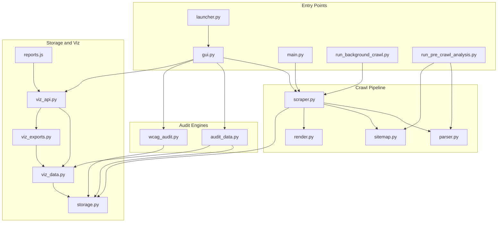
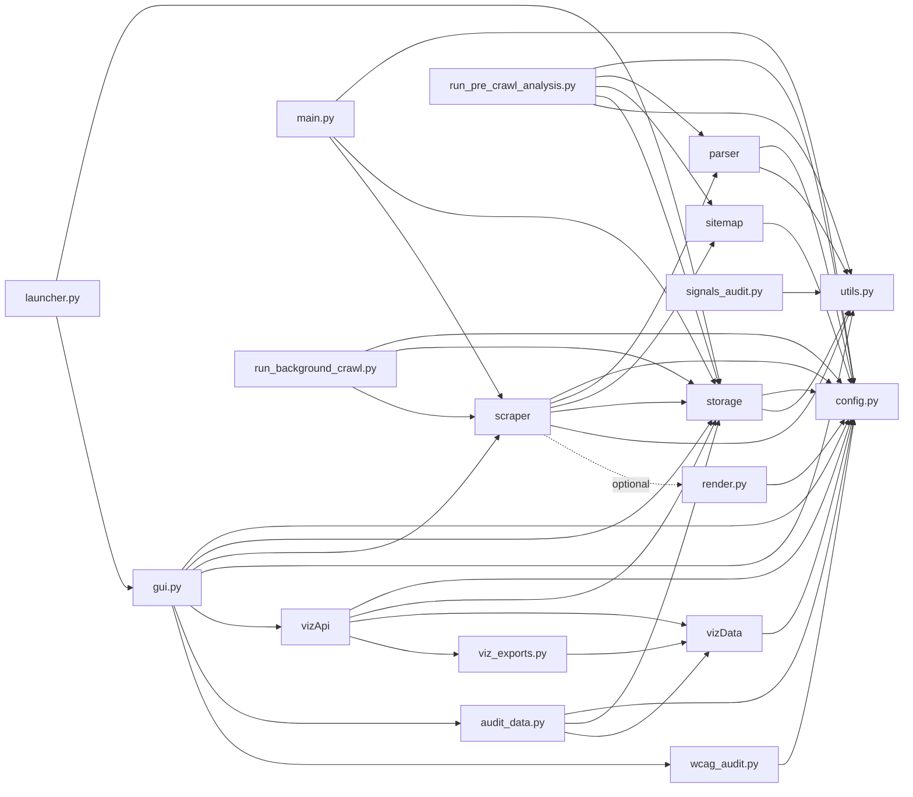
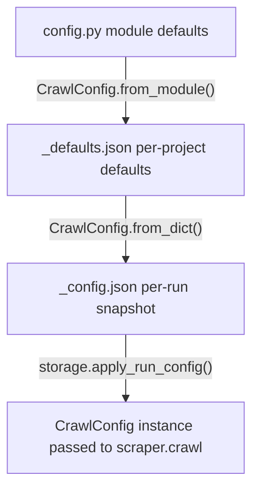
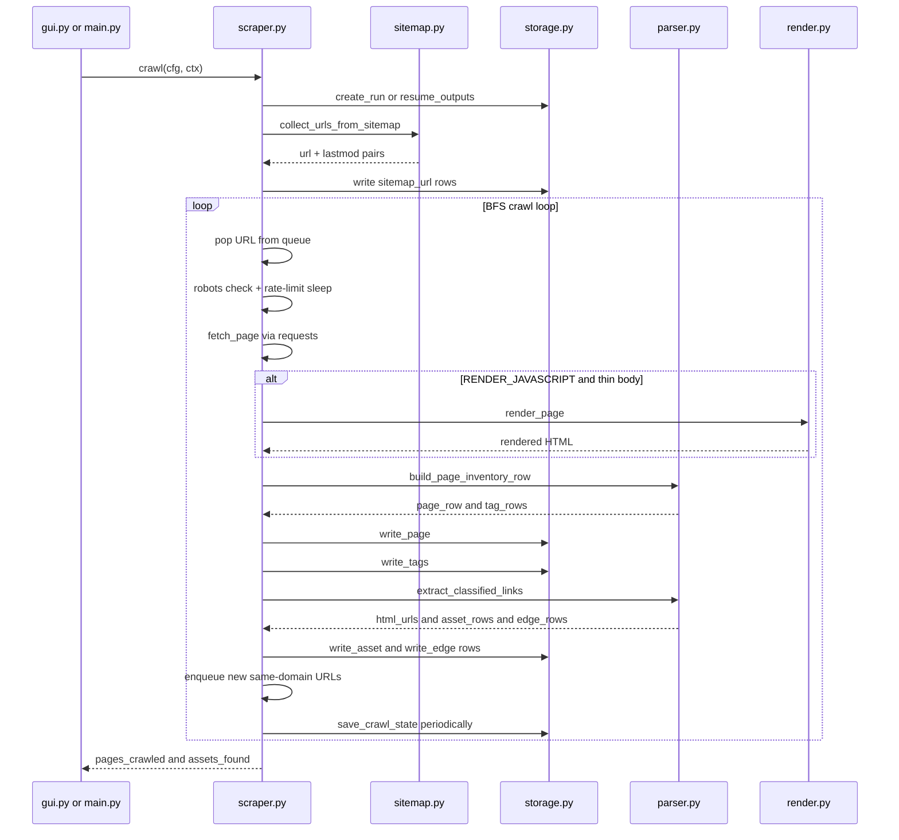
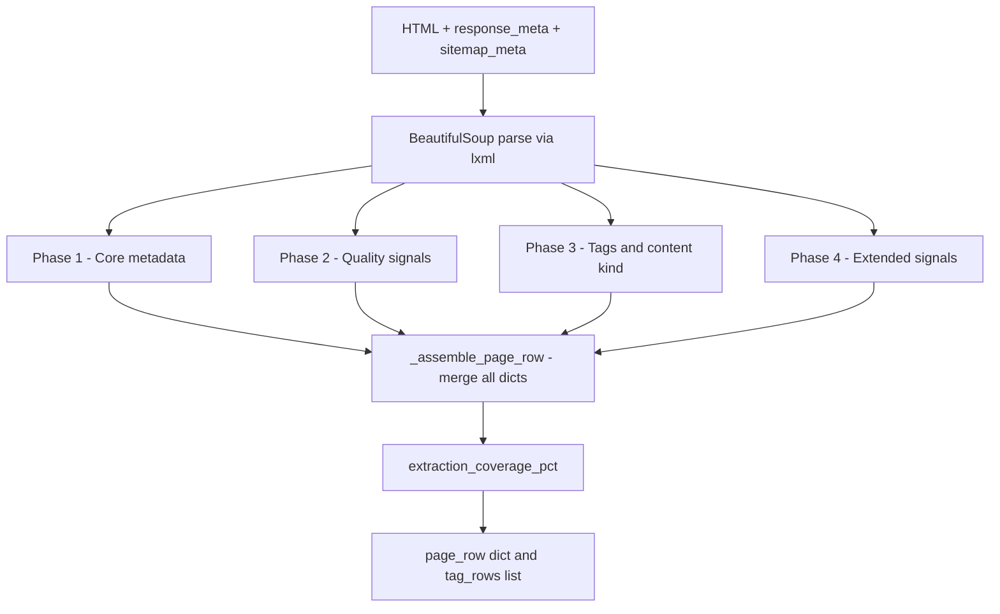
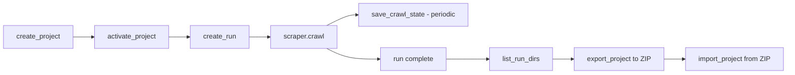
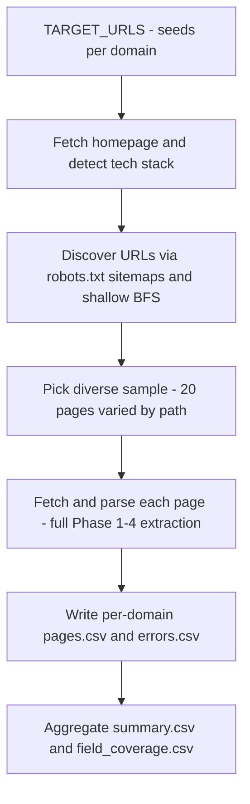
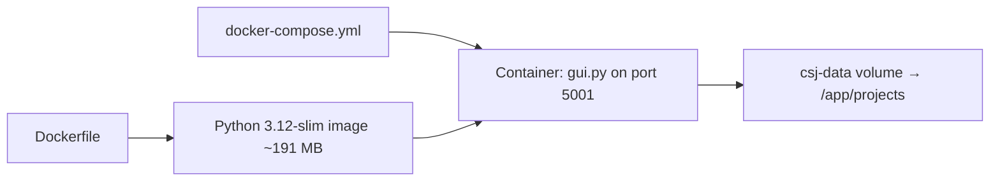
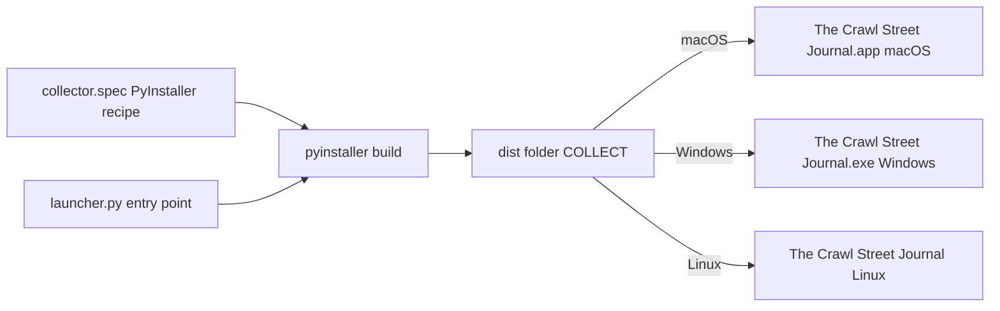

# Architecture — The Crawl Street Journal

This document describes how the application is built and how it works, from high-level structure down to individual module responsibilities. It is intended for developers picking up the codebase.

---

## Table of contents

1. [High-level overview](#1-high-level-overview)
2. [Module dependency map](#2-module-dependency-map)
3. [Entry points](#3-entry-points)
4. [Configuration system](#4-configuration-system)
5. [Project and run data model](#5-project-and-run-data-model)
6. [Crawl pipeline](#6-crawl-pipeline)
7. [Parser architecture (Phases 1–4)](#7-parser-architecture-phases-14)
8. [Storage layer](#8-storage-layer)
9. [Ecosystem visualisation layer](#9-ecosystem-visualisation-layer)
10. [Pre-crawl analysis](#10-pre-crawl-analysis)
11. [Signals audit module](#11-signals-audit-module)
12. [Audit engines](#12-audit-engines)
13. [Docker deployment](#13-docker-deployment)
14. [Desktop packaging](#14-desktop-packaging)
15. [Testing](#15-testing)

---

## 1. High-level overview

The Crawl Street Journal is a **single-process Python application** with a Flask web GUI. There are no databases or separate microservices. Persistence is entirely filesystem-based: JSON for configuration and crawl state, CSV for all output data. A `Dockerfile` is provided for containerised deployment, but the application itself remains a single process.

The application has four conceptual layers:

- **Entry points** — how the application is started (desktop app, Flask GUI, CLI scripts)
- **Crawl pipeline** — the modules that orchestrate fetching, parsing, and writing
- **Audit engines** — content audit (`audit_data.py`) and WCAG 2.1 accessibility audit (`wcag_audit.py`) that analyse crawl output
- **Storage and visualisation** — the modules that persist and aggregate data



---

## 2. Module dependency map

The directed graph below shows which modules import which. `utils.py` and `config.py` are the only leaf dependencies; no CSJ module is imported by them (preventing circular imports).

**Note:** `gui.py` and `viz_api.py` no longer mutate `config.OUTPUT_DIR`. All path resolution goes through pure helper functions (`_runs_dir`, `_run_dir`, `get_project_runs_dir`). Global `config.OUTPUT_DIR` mutation is preserved only for CLI backward compatibility (`main.py`, `run_background_crawl.py`).



---

## 3. Entry points

### 3.1 `launcher.py` — desktop application

Used when the application is distributed as a packaged `.app` / `.exe`. It:

1. Calls `storage.migrate_legacy_data()` to handle any data from older versions
2. Probes TCP ports starting at **5001** (up to 10 attempts) to find a free one
3. Starts Flask in a **daemon thread**
4. Opens a **native `pywebview` window** (WebKit on macOS, Edge/WebView2 on Windows, WebKitGTK on Linux) pointing at the Flask server. If the `pywebview` backend is not available, falls back to `webbrowser.open`.
5. Registers `SIGINT` / `SIGTERM` handlers so the app exits cleanly
6. Wraps the entire `main()` call in a crash handler that writes `crash.log` to `DATA_DIR` on unhandled exceptions

### 3.2 `gui.py` — Flask web application

The main user-facing application. It runs on port **5001** (or the next free port if launched via `launcher.py`), serves all HTML templates, and manages crawl threads.

**Key internal type — `CrawlSlot`:**

Each project can have at most one active crawl at a time. A `CrawlSlot` holds:
- a daemon `threading.Thread` running `scraper.crawl`
- a `threading.Event` for stop signalling
- a mutable `status` dict (pages crawled, assets, current URL, phase)
- the `CrawlConfig` and `StorageContext` for that run
- a monotonic start time for elapsed-time calculation

**Startup:** `gui.py` calls `storage_module.migrate_legacy_data()` to handle pre-project-era data layouts, and `storage_module.recover_stale_running_states()` to mark any runs left in `running` state (from unclean shutdowns) as `interrupted`.

**Route groups:**

| Group | Routes |
|-------|--------|
| Projects | `/` (list), create, delete, export ZIP, import ZIP |
| Project pages | overview (redirect to Dashboard), settings (GET), defaults (GET → redirect to Settings, POST), runs list, create run |
| Audits | `/p/<slug>/audit` (content audit), `/p/<slug>/wcag` (WCAG audit), `/p/<slug>/api/audit` (JSON), `/p/<slug>/api/wcag` (JSON) |
| Run management | config (GET/POST), monitor, start, stop, resume, rename, delete |
| Results | results hub, paginated CSV viewer, single-file download, all-CSVs ZIP |
| SSE streams | `/api/progress/<slug>`, `/api/logs` |
| Reports | registered via `viz_api.eco_bp` blueprint — Dashboard (`/p/<slug>/reports`), JSON APIs under `/p/<slug>/api/viz/…`, and ZIP export routes under `/p/<slug>/export/…` |

**SSE (Server-Sent Events):**

- `/api/progress/<slug>` — streams `status` dict updates (pages, assets, elapsed) every ~1 s while a crawl is running
- `/api/logs` — streams formatted log lines from `_BufferHandler` (a `logging.Handler` that pushes into a deque of 2000 lines)

### 3.3 `main.py` — interactive CLI

Simple terminal entry point. Registers `SIGINT` / `SIGTERM` handlers, optionally calls `storage.activate_project`, then calls `scraper.crawl` directly using module-level `config` globals (not a `CrawlConfig` instance). Logs progress every 10 HTML pages.

### 3.4 `run_background_crawl.py` — headless long run

Identical structure to `main.py` but:
- Sets `config.MAX_PAGES_TO_CRAWL = 1_000_000` **before** importing `scraper` (so the module-level constant is seen by the crawl loop at its raised value)
- Logs to a file handler (`crawl_background.log`) rather than stdout
- Reports progress every 50 pages

---

## 4. Configuration system

### 4.1 Module-level defaults (`config.py`)

`config.py` contains plain Python module-level assignments that act as the application's default configuration. Every other module reads these at import time or via explicit `import config`.

Key categories of settings:

| Category | Examples |
|----------|---------|
| Paths | `OUTPUT_DIR`, `DATA_DIR`, `BUNDLE_DIR`, `PROJECTS_DIR` |
| Seeds and scope | `SEED_URLS`, `SITEMAP_URLS`, `ALLOWED_DOMAINS`, `EXCLUDED_DOMAINS`, `URL_EXCLUDE_PATTERNS`, `URL_INCLUDE_PATTERNS` |
| Crawl behaviour | `MAX_PAGES_TO_CRAWL`, `MAX_DEPTH`, `REQUEST_DELAY_SECONDS`, `CONCURRENT_WORKERS`, `STATE_SAVE_INTERVAL` |
| Feature toggles | `WRITE_EDGES_CSV`, `WRITE_TAGS_CSV`, `WRITE_SITEMAP_URLS_CSV`, `WRITE_NAV_LINKS_CSV`, `CAPTURE_READABILITY`, `RENDER_JAVASCRIPT`, `CHECK_OUTBOUND_LINKS`, `CONTENT_DEDUP`, `CHANGE_DETECTION`, `RESPECT_ROBOTS_TXT` |
| Asset handling | `SKIP_EXTENSIONS`, `ASSET_CATEGORY_BY_EXT`, `ASSET_HEAD_METADATA` |
| Domain ownership | `DOMAIN_OWNERSHIP_RULES`, `DOMAIN_OWNERSHIP_DEFAULT` |
| Identity and logging | `USER_AGENT`, `LOG_LEVEL` |

`DATA_DIR` and `BUNDLE_DIR` are resolved at import time to handle both dev (source tree) and PyInstaller frozen (`sys._MEIPASS`) environments.

### 4.2 `CrawlConfig` dataclass

`CrawlConfig` is a frozen snapshot of the configuration for a single crawl run. It is defined in `config.py` as a `@dataclass`.

```
CrawlConfig
├── from_module()     → copies current config.* globals into an instance
├── from_dict(d)      → overlays a dict (e.g. from _config.json) over from_module()
└── to_dict()         → JSON-serialisable dict (omits OUTPUT_DIR)
```

The GUI always passes a `CrawlConfig` instance to `scraper.crawl`. The CLI entry points use the module globals directly.

### 4.3 Configuration layering in the GUI



When a new run is created, the project's `_defaults.json` is loaded over the module defaults. When a run is started, the run's `_config.json` (saved when the user clicks Save on the config form) is applied. The resulting `CrawlConfig` is immutable for the lifetime of the crawl.

---

## 5. Project and run data model

All data lives under `projects/` in the working directory (or `DATA_DIR` in the packaged app).

```
projects/
├── <slug>/
│   ├── _project.json          # {"name": "...", "created_at": "..."}
│   ├── _defaults.json         # CrawlConfig.to_dict() for new runs
│   └── runs/
│       ├── run_20240101T120000_my-label/
│       │   ├── _config.json   # CrawlConfig snapshot (frozen at run creation)
│       │   ├── _state.json    # resume checkpoint: visited URLs + pending queue
│       │   ├── pages.csv
│       │   ├── edges.csv
│       │   ├── tags.csv
│       │   ├── nav_links.csv
│       │   ├── sitemap_urls.csv
│       │   ├── assets_pdf.csv
│       │   ├── assets_office.csv
│       │   ├── assets_image.csv
│       │   ├── assets_video.csv
│       │   ├── assets_other.csv
│       │   ├── link_checks.csv
│       │   ├── phone_numbers.csv
│       │   └── crawl_errors.csv
│       └── .latest            # plain text: name of most recent run folder
└── pre_crawl_analysis/        # output of run_pre_crawl_analysis.py
    ├── <sanitised-netloc>/
    │   ├── pages.csv
    │   └── errors.csv
    ├── summary.csv
    └── field_coverage.csv
```

**Run folder naming:** `run_<UTC-datetime-compact>_<sanitised-label>`, e.g. `run_20240315T093042_govuk-content`.

**`_state.json` resume format:** stores serialised `visited` URL set and `crawl_queue` / `seed_queue` contents, plus the count of pages and assets written so far. On resume, `storage.rebuild_visited_from_csvs` re-reads `pages.csv` and all asset CSVs to reconstruct the visited set, then merges with `_state.json`.

**`.latest`:** contains the folder name (not a filesystem symlink) of the most recent run for quick access by the GUI.

---

## 6. Crawl pipeline

### 6.1 Overview sequence



### 6.2 Priority queue scheduling

The scraper uses a heap-based `_PriorityQueue` with URL scoring via `_score_url()`. Each item is `(score, counter, url, referrer, depth)` where lower scores are fetched first. Scoring factors:

- **Seed bonus** (−100) — seed and sitemap URLs sort to the top
- **Depth penalty** (×10) — deeper pages are deferred
- **Homepage bonus** (−5) — root paths are prioritised
- **Low-value path penalty** (+20) — archive, pagination, and CMS infrastructure paths (`/tag/`, `/page/`, `/wp-content/`) are deprioritised

The counter field breaks ties in FIFO order so URLs at the same score are processed in discovery order. This single-queue design replaces the former dual-deque (crawl_queue + seed_queue) architecture, where seeds naturally sort to the top via scoring rather than requiring a separate queue.

### 6.3 URL normalisation

Every URL is normalised before entering the queue or visited set:

1. Parse with `urllib.parse.urlparse`
2. Scheme → `https`
3. Strip default ports (`:80`, `:443`)
4. Lowercase host
5. Strip fragment (`#...`)
6. Remove trailing slash from path
7. Sort query parameters alphabetically

This prevents the same logical page being fetched under cosmetically different URLs.

### 6.4 robots.txt handling

- `_robots_for_url(url)` fetches and parses `robots.txt` for the origin, using `urllib.robotparser.RobotFileParser`
- Results are cached in `_robots_cache` (keyed by origin) with a `threading.Lock`
- Origins that fail to return a parseable `robots.txt` are added to `_blocked_origins` to avoid repeated failed fetches
- `can_fetch(url, user_agent)` consults the cached parser

### 6.5 Rate limiting

- `_domain_last_fetch` (dict: hostname → monotonic time) tracks when each host was last fetched
- The scraper sleeps for `REQUEST_DELAY_SECONDS` (fixed or random range) between requests to the same host
- On repeated failures, `_domain_fail_count` triggers adaptive exponential back-off per host

### 6.6 Optional Playwright rendering

If `config.RENDER_JAVASCRIPT` is `True` and `render.is_available()` returns `True`, the scraper re-fetches any page whose response body is shorter than a configured threshold using a headless Chromium browser via `render.render_page(url)`. This handles pages that rely on client-side rendering for their primary content. Playwright is not installed by default; see the README for installation instructions.

### 6.7 Concurrent fetching and engine optimisations

**Concurrent fetching** is supported via `ThreadPoolExecutor` when `CONCURRENT_WORKERS > 1`. The crawl loop drains a batch of URLs from the priority queue and submits them to the pool. Per-domain rate limiting is preserved because `_wait_for_domain()` uses a thread-safe lock. When `CONCURRENT_WORKERS = 1` (default), the original sequential code path is used with zero regression risk.

Cross-cutting behaviours:

- **DNS caching** — A process-global cache wraps `socket.getaddrinfo` (monkey-patched for the process) so repeated hostname lookups during crawling are fast. Entries expire after a **5-minute TTL** (`_DNS_TTL = 300`) to avoid unbounded growth.
- **Thread-safe data structures** — `_ThreadSafeSet` and `_ThreadSafeDict` wrap the visited set, queued set, and content hashes dict so concurrent workers (`CONCURRENT_WORKERS > 1`) cannot corrupt shared state. `StorageContext.append_row` is guarded by a per-instance `_csv_lock` to prevent interleaved CSV writes.
- **Crawl-delay from robots.txt** — `Crawl-delay` values in `robots.txt` are parsed and applied as a **floor** for per-domain delay, combined with `REQUEST_DELAY_SECONDS` and the existing rate limiting.
- **Content hash deduplication** — Each page’s **visible text** is hashed with **SHA-256**; when `CONTENT_DEDUP` is enabled, URLs whose hash matches an already-seen page in the same run are skipped so identical content is not crawled twice.
- **Change detection across runs** — When `CHANGE_DETECTION` is enabled, content hashes are compared against prior run data so unchanged vs changed pages can be flagged between runs.

---

## 7. Parser architecture (Phases 1–4)

`parser.py` contains a single public function — `build_page_inventory_row` — and many private helpers. The extraction is conceptually divided into four phases, all applied on every crawled page.



### Phase 1 — core metadata

| Field group | Sources |
|-------------|---------|
| Title | `<title>`, `og:title`, first `<h1>` |
| Description | `meta[name=description]`, `og:description`, `twitter:description`, first substantial `<p>` |
| Language | `html[lang]` |
| Canonical URL | `link[rel=canonical]` |
| Open Graph | `og:title`, `og:type`, `og:description` |
| Twitter card | `twitter:card` |
| JSON-LD types | `@type` from all `application/ld+json` blocks, pipe-separated |

### Phase 2 — quality signals

| Field group | Sources / method |
|-------------|-----------------|
| Headings | `h1_joined` (up to 5 H1 texts), `heading_outline` (H2–H6 outline) |
| Word count | visible text after stripping scripts/styles |
| Readability | `textstat.flesch_kincaid_grade` (when `CAPTURE_READABILITY`, ≥30 words) |
| Dates | JSON-LD `datePublished`/`dateModified`, `article:*_time` meta, `<time datetime>`, regex visible-text patterns |
| Links | internal/external/total `<a>` counts |
| Images | count + missing-alt count |
| Privacy policy | first link matching common privacy URL patterns |
| Analytics signals | GTM, GA4, Matomo, and other tokens found in raw HTML |
| Training flag | `TRAINING_KEYWORDS` matched in URL, title, or H1 |

### Phase 2 also — WCAG static signals

| Field | Check |
|-------|-------|
| `wcag_lang_valid` | `html[lang]` present and non-empty |
| `wcag_heading_order_valid` | no heading level skipped |
| `wcag_title_present` | non-empty `<title>` |
| `wcag_form_labels_pct` | % of form controls with associated label |
| `wcag_landmarks_present` | any ARIA landmark or HTML5 sectioning element |
| `wcag_vague_link_pct` | % of links with vague visible text |

**Crawl-time technical fields (also in `pages.csv`):**

| Field | Source |
|-------|--------|
| `fetch_time_ms` | `scraper.py` — wall-clock milliseconds for the successful HTML GET (including retries) |
| `has_viewport_meta` | `parser.py` — `1` / `0` whether a `<meta name="viewport">` tag is present (basic responsive signal) |

### Phase 3 — tags and content classification

**Tag extraction sources (in priority order):**

1. `meta[name=keywords/news_keywords/subject]` — split on `,`, `;`, `|`
2. `meta[property="article:tag"]` and `meta[property="article:section"]`
3. JSON-LD `keywords`, `articleSection`, `genre`
4. `a[rel~=tag]` visible text
5. Links with `/category/`, `/tag/`, `/topic/` path segments
6. Elements with CSS class `topics`

Tags are deduplicated by `(text, source)` for `tags_all` and `tags.csv`.

**Content kind classification** (`content_kind_guess`) uses a priority cascade:

1. URL path tokens (`/blog`, `/news`, `/guidance`, `/statistics`, `/events`, `/jobs`, etc.)
2. JSON-LD `@type` (`BlogPosting`, `NewsArticle`, `FAQPage`, `Event`, etc.)
3. `og:type` (`article`, `profile`, `product`, etc.)
4. Breadcrumb trail text
5. Body CSS classes (CMS-specific: SilverStripe page types, Drupal `page-node-type-*`, etc.)
6. Default: `webpage`

### Phase 4 — extended signals

Phase 4 extracts richer structured data and provenance signals added in a later development phase. All columns are always present in `pages.csv`; they may be empty for pages that lack the relevant markup.

| Field group | Sources |
|-------------|---------|
| Author | JSON-LD `author.name`, `meta[name=author]`, byline class patterns |
| Publisher | JSON-LD `publisher.name`, `og:site_name` |
| JSON-LD `@id` | primary block's `@id` value |
| CMS generator | `meta[name=generator]`, CDN URL patterns (Shopify, WP Engine, etc.), HTML markers (WordPress, Drupal, SharePoint, Next.js, Gatsby) |
| Robots directives | `meta[name=robots]` + `X-Robots-Tag` response header, merged |
| Hreflang | all `link[rel=alternate][hreflang]` hrefs, pipe-separated |
| Feeds | `link[rel=alternate][type=application/rss+xml]` etc., pipe-separated |
| Pagination | `link[rel=next]` and `link[rel=prev]` hrefs |
| Breadcrumb schema | `BreadcrumbList` JSON-LD item names, pipe-separated |
| Microdata types | all `itemtype` attribute values, pipe-separated |
| RDFa types | all `typeof` attribute values, pipe-separated |
| Product schema | price, currency, availability, rating, review count from `Product` JSON-LD/microdata |
| Event schema | event date and location from `Event` JSON-LD |
| Job schema | job title and location from `JobPosting` JSON-LD |
| Recipe schema | total time from `Recipe` JSON-LD |
| Coverage | `extraction_coverage_pct` — % of Phase 1–4 fields that are non-empty |

---

## 8. Storage layer

### 8.1 Two modes: `StorageContext` vs module-level functions

`storage.py` exposes two parallel interfaces for writing crawl output:

| Interface | Used by | How it works |
|-----------|---------|-------------|
| `StorageContext` class | GUI (`gui.py`) | Instance holds `output_dir`, `cfg`, `active_run_dir`; all write methods are instance methods. Supports multiple concurrent projects without shared global state. |
| Module-level functions | CLI (`main.py`, `run_background_crawl.py`) | Use `_active_run_dir` module global set by `activate_project` / `initialise_outputs`. Not safe for concurrent crawls. |

### 8.2 CSV write pipeline

Every write goes through:

1. **`utils.sanitise_csv_value`** — coerce `None` to `""`, strip null bytes, truncate at 32 000 characters
2. **`csv.writer(quoting=csv.QUOTE_ALL)`** — every field double-quoted regardless of content
3. **Append mode** — rows are appended to existing files so the crawl can be stopped and resumed without losing data

The header row is written once by `initialise_outputs` / `resume_outputs` at run start. If a row write fails for any reason, the error is logged and the crawl continues.

### 8.3 CSV schemas

| File | Key fields |
|------|-----------|
| `pages.csv` | ~82 fields: Phase 1–4 metadata + WCAG (15 columns) + provenance + `content_hash` + `content_changed` + `fetch_time_ms` + `has_viewport_meta` (see README for full list) |
| `keyword_log.csv` | Optional per-run file: configurable visible-text keyword hits (`page_url`, term, context, etc.) when keyword logging is enabled |
| `assets_<category>.csv` | `referrer_page_url`, `asset_url`, `link_text`, `category`, `head_content_type`, `head_content_length`, `discovered_at` |
| `edges.csv` | `from_url`, `to_url`, `link_text`, `discovered_at` |
| `tags.csv` | `page_url`, `tag_value`, `tag_source`, `discovered_at` |
| `nav_links.csv` | `page_url`, `nav_href`, `nav_text`, `discovered_at` |
| `sitemap_urls.csv` | `url`, `lastmod`, `source_sitemap`, `discovered_at` |
| `link_checks.csv` | `from_url`, `to_url`, `check_status`, `check_final_url`, `discovered_at` |
| `phone_numbers.csv` | `page_url`, `raw_href`, `phone_number`, `link_text`, `discovered_at` |
| `crawl_errors.csv` | Requested URL, `final_url`, `referrer_url`, `depth`, `error_type`, `failure_class`, `message`, `http_status`, `content_type`, redirect metadata, `attempt_number`, `robots_txt_rule`, `worker_id`, `discovered_at` |

### 8.4 Project lifecycle



**Export/import:** `export_project` produces an in-memory `io.BytesIO` ZIP containing all run folders and metadata. `import_project` unpacks a ZIP into `PROJECTS_DIR`, supporting migration between machines.

**Legacy migration:** `migrate_legacy_data()` is called at startup by `launcher.py` and `gui.py`. It moves any run folders from the old flat `output/` layout into the project structure.

### 8.5 Resume mechanism

When `--resume` is passed (or the GUI resumes a run):

1. `storage.rebuild_visited_from_csvs(run_dir)` reads `pages.csv` and `crawl_errors.csv` to reconstruct the set of already-processed URLs
2. `storage.rebuild_sitemap_meta_from_csv(run_dir)` reconstructs the sitemap metadata lookup from `sitemap_urls.csv`
3. `storage.load_crawl_state(run_dir)` loads `_state.json` for the pending queue and page/asset counters
4. `storage.resume_outputs(run_dir)` opens existing CSV files in append mode rather than overwriting them
5. The scraper skips any URL already in the visited set

**Terminal state after resume:** if a resume session completes without user stop but **writes no new pages** (empty queue or no progress), `scraper.crawl()` still finalises with **`interrupted`** — not **`completed`** — so imported or gap runs are not mis-labelled as finished (see §8.6).

### 8.6 Run status (`get_run_status`) and imported projects

`storage.get_run_status(run_dir)` derives UI state from `_state.json` and CSV presence:

- If **`_state.json` is missing** but `pages.csv` has at least one data row, the run is treated as **`interrupted`** (typical imported archive without crawl state). This avoids the GUI offering **Start** on a folder that already contains crawl output — **Start** would call `initialise_outputs` and truncate CSVs.
- If **`_state.json` exists** with `status: "new"` but `pages.csv` has rows, status is normalised to **`interrupted`** (inconsistent state).

Otherwise the on-disk `status` field is used (`running`, `interrupted`, `completed`). Stale `running` without a live crawl thread is mapped to **`interrupted`** in the GUI via `_effective_run_status` in `gui.py`.

### 8.7 Multi-run reporting merge (`viz_data.py`)

When the dashboard aggregates **more than one** `run_*` directory (including a gap-refetch run alongside its source run), `viz_data` **merges** rows instead of concatenating duplicate URLs:

- Runs are ordered by folder name (`run_*` timestamp); **older first, then newer**.
- **Newer run wins** for the same logical key: e.g. `requested_url` for `pages.csv`, `(from_url, to_url)` for `edges.csv`, `url` for `crawl_errors.csv` (with errors dropped when the merged page row shows a 2xx/3xx success), and analogous keys for `tags.csv`, `nav_links.csv`, and `assets_*.csv`.

Public helpers (`merged_page_rows_for_runs`, `merged_error_rows_for_runs`, `merged_asset_rows_for_runs`, `merged_edge_rows_for_runs`) mirror this logic for the project **Reports** overview counts in `viz_api.py`. The content audit (`audit_data.py`) uses the same merge helpers so audit results align with the ecosystem dashboard.

### 8.8 Operational utility: import ZIP resume state

`tools/fix_project_zip_resume_state.py` rewrites (or adds) `_state.json` per run that has `pages.csv` data — useful when preparing a hand-merged project ZIP so on-disk status matches resumable crawl semantics.

---

## 9. Ecosystem visualisation layer

The ecosystem dashboard is a separate read-only layer that sits entirely on top of the completed crawl output. It never writes crawl data to disk (exports are generated on demand in memory). **~30** D3 or HTML-table panels are organised into **8 tab groups** on `reports.html`, and all panels share a unified filter system. Multi-run selections apply **`viz_data`** merge rules (§8.7) so overlapping URLs from a baseline crawl plus a gap-refetch run contribute **one** logical row to aggregates.

### 9.1 Architecture

```mermaid
graph LR
    browser[Browser]
    reportsHtml[reports.html Jinja2 template]
    reportsJs[reports.js D3 v7]
    vizApiBp[viz_api.py Flask blueprint]
    vizDataMod[viz_data.py aggregators]
    vizExports[viz_exports.py ZIP builders]
    csvFiles[Run CSVs - pages.csv edges.csv etc]

    browser --> reportsHtml
    reportsHtml --> reportsJs
    reportsJs -->|JSON API calls with filters| vizApiBp
    vizApiBp --> vizDataMod
    vizApiBp --> vizExports
    vizExports --> vizDataMod
    vizDataMod -->|csv.DictReader| csvFiles
```



**`viz_exports.py`** builds UTF-8 CSV files inside a ZIP response for selected reports (full breakdowns for spreadsheets or external PDF printing). It reuses the same aggregators as the dashboard with `full_lists=True`.

### 9.2 Tab groups (UI)

| Tab group | Focus |
|-----------|--------|
| Governance | Network, treemap, analytics matrix, chord, bubble, content types, page depth, crawl landscape |
| Trust | Status & errors, freshness, quality radar, parallel coordinates |
| Content & on-site performance | On-site performance audit (thin/duplicate URLs, internal links, keyword alignment), content health matrix |
| Findability | Navigation sunburst, themes word cloud, indexability |
| Technical performance | Technical performance report (per-domain fetch time, viewport, assets), key metrics snapshot (crawl proxies for discovery mix / structure / schema commerce) |
| Technology & standards | CMS landscape, structured data, SEO readiness, extraction coverage |
| Competitive intelligence | Competitor intelligence (tags, schema commerce, in-crawl cross-domain edges) |
| Provenance & authorship | Author network, publishers, schema-specific insights |

### 9.3 Filtering

All JSON API endpoints accept the same filter query parameters (paths below are relative to `/p/<slug>/`):

| Parameter | Filters on |
|-----------|------------|
| `runs` | Comma-separated run folder names to include |
| `domains` | Comma-separated hostname substrings |
| `cms` | Comma-separated `cms_generator` substrings |
| `content_kinds` | Comma-separated `content_kind_guess` values |
| `schema_formats` | `json_ld`, `microdata`, or `rdfa` |
| `schema_types` | JSON-LD `@type` substring |
| `date_from` / `date_to` | Filter by `date_published` range |
| `min_coverage` | Minimum `extraction_coverage_pct` (0–100) |
| `full` | When `1`, `true`, `yes`, or `all`, several report endpoints return **uncapped** list payloads instead of dashboard samples (larger JSON) |

`viz_data.filter_pages` applies all active filters as an AND condition before any aggregation.

### 9.4 API endpoints and D3 panels

Paths are under `/p/<slug>/api/viz/…` unless noted.

| Panel (`data-panel`) | Tab group | Primary API | `viz_data` function |
|----------------------|-----------|-------------|---------------------|
| `network` | Governance | `graph` | `aggregate_domain_graph` |
| `treemap` | Governance | `domains` | `aggregate_domains` |
| `analytics` | Governance | `domains` | `aggregate_domains` |
| `chord` | Governance | `chord` | `aggregate_chord` |
| `bubble` | Governance | `domains` | `aggregate_domains` |
| `contenttypes` | Governance | `domains` | `aggregate_domains` |
| `pagedepth` | Governance | `page_depth` | `aggregate_page_depth` |
| `landscape` | Governance | `domains` | `aggregate_domains` (axes chosen client-side) |
| `status` | Trust | `domains` | `aggregate_domains` |
| `freshness` | Trust | `freshness` | `aggregate_freshness` |
| `radar` | Trust | `domains` | `aggregate_domains` |
| `parallel` | Trust | `domains` | `aggregate_domains` |
| `contentaudit` | Content & on-site | `content_performance_audit` | `aggregate_content_performance_audit` |
| `contenthealth` | Content & on-site | `content_health` | `aggregate_content_health` |
| `sunburst` | Findability | `navigation` | `aggregate_navigation` |
| `wordcloud` | Findability | `tags` | `aggregate_tags` |
| `indexability` | Findability | `indexability` | `aggregate_indexability` |
| `techperformance` | Technical performance | `technical_performance` | `aggregate_technical_performance` |
| `keymetrics` | Technical performance | `key_metrics_snapshot` | `aggregate_key_metrics_snapshot` |
| `cmslandscape` | Technology | `technology` | `aggregate_technology` |
| `structureddata` | Technology | `technology` | `aggregate_technology` |
| `seoreadiness` | Technology | `technology` | `aggregate_technology` |
| `coverage` | Technology | `technology` | `aggregate_technology` |
| `competitorintel` | Competitive intelligence | `competitor_intelligence` | `aggregate_competitor_intelligence` |
| `authornetwork` | Provenance | `authorship` | `aggregate_authorship` |
| `publishers` | Provenance | `authorship` | `aggregate_authorship` |
| `schemainsights` | Provenance | `schema_insights` | `aggregate_schema_insights` |

**Supporting endpoints:** `runs`, `filter_options` (`get_filter_options`).

**ZIP exports (GET `/p/<slug>/export/…`):** `content_performance_audit.zip`, `technical_performance.zip`, `key_metrics_snapshot.zip`, `indexability.zip`, `competitor_intelligence.zip` — each applies the same filter query string as the JSON APIs.

### 9.5 Report semantics (brief)

Several panels are **heuristic summaries** of crawl exports, not live analytics products:

- **Indexability** — `noindex` from `robots_directives` plus `robots_disallowed` rows in `crawl_errors.csv`.
- **Competitor intelligence** — tag frequencies, schema.org product fields, and cross-domain edges from `edges.csv` (not third-party backlink indexes).
- **On-site performance audit** — thin content, `content_hash` / canonical collisions, internal edges, `tags_all` vs title/H1 alignment.
- **Technical performance** — crawl fetch time, viewport meta, asset inventory from `assets_*.csv`.
- **Key metrics snapshot** — discovery referrer buckets and structural proxies; not Google Analytics sessions.

### 9.6 Frontend caching and filter flow

`reports.js` maintains an in-memory `cache` keyed by full request URL (including query string). On every filter change:

1. `onFilterChange` clears `cache` and the `rendered` guard (which prevents a panel re-rendering on tab revisit)
2. `reloadFilterOptions()` fetches `filter_options` with the current `runs` selection to populate dropdowns with values present in the selected data
3. The active panel re-renders via `renderPanel(activePanelName)`

`ECO_PRESELECTED_RUNS` (injected from the template via Jinja2) pre-seeds the runs filter when navigating from a per-run "Reports" link.

---

## 10. Pre-crawl analysis

`run_pre_crawl_analysis.py` is a standalone sampling tool. It is not called by the main crawl pipeline but shares the same `parser`, `sitemap`, and `storage` modules.



**Tech stack detection** (`detect_tech_stack`) inspects:
- `meta[name=generator]` content
- HTML markers (WordPress admin paths, Drupal classes, SharePoint `_layouts`, etc.)
- CDN URLs (Shopify CDN, WP Engine, etc.)
- Response headers (server, `X-Powered-By`, etc.)
- SPA heuristics (React root, Next.js `__NEXT_DATA__`, Gatsby, etc.)

**Diverse URL sampling** (`_pick_diverse`) does a round-robin selection across URLs grouped by their first path segment, so the sample represents different site sections rather than being biased towards one area.

**Domain isolation:** during the run, `config.ALLOWED_DOMAINS` is temporarily replaced with a permissive suffix list (`_PRE_CRAWL_ALLOWED_DOMAINS`) that allows cross-domain fetches. The original value is restored in a `finally` block.

---

## 11. Signals audit module

`signals_audit.py` is a **research and testing tool** that is entirely separate from the main crawl pipeline. It is not called by `scraper.py`, `parser.py`, or any GUI route.

**Purpose:** given a single HTML page (and optionally its HTTP response headers), produce a complete inventory of every metadata signal present: meta tags, link elements, JSON-LD blocks, Microdata, RDFa, Open Graph, Twitter cards, HTML landmark structure, `data-*` attribute names, `<time>` elements, and relevant response headers.

**API:**

```python
report = signals_audit.audit_page(html, url="", response_headers=None)
# → nested dict with keys: meta, links, json_ld, microdata, rdfa,
#   open_graph, twitter, html_signals, data_attributes, time_elements, response_headers

summary = signals_audit.summarise_audit(report)
# → flat dict: has_*, generator, server, og_properties (pipe-separated), etc.
```

It is used by `tests/test_signals_audit.py` and can be used standalone for debugging or signal research on individual pages.

---

## 12. Audit engines

Two post-crawl audit modules analyse completed crawl data and surface findings via dedicated GUI routes.

### 12.1 Content audit (`audit_data.py`)

`audit_data.py` reads `pages.csv`, `edges.csv`, and `crawl_errors.csv` via **`viz_data` merge helpers** when multiple run directories are passed, so audit findings match the ecosystem dashboard (no duplicate URLs from gap-refetch overlays). It produces structured findings across **10 finding types**:

| Finding type | What it detects |
|-------------|----------------|
| Duplicate content | Pages with identical or near-identical titles and meta descriptions |
| Redirect chains | Pages whose `requested_url` ≠ `final_url` (HTTP redirects) |
| Thin content | Pages below a configurable word-count threshold |
| Title quality | Missing, duplicate, or excessively long page titles |
| Meta description quality | Missing, duplicate, or excessively long meta descriptions |
| Orphan pages | Pages with no inbound internal links (based on `edges.csv`) |
| Link distribution | Pages with unusually high or low internal/external link counts |
| Image accessibility | Pages with a high proportion of images missing `alt` text |
| URL structure | URLs with problematic patterns (excessive depth, query parameters, non-lowercase) |
| Content decay | Pages whose published/modified dates suggest stale content |
| Broken links | Entries from `crawl_errors.csv` indicating unreachable pages |

The top-level function `run_full_audit(run_dirs)` orchestrates all checks and returns them keyed by finding type, each with a severity summary and a list of finding rows.

**Route:** `/p/<slug>/audit` — renders the `audit.html` template with the audit results for the selected project runs.

### 12.2 WCAG 2.1 audit (`wcag_audit.py`)

`wcag_audit.py` analyses the WCAG signal columns in `pages.csv` against **13 testable Level A and AA success criteria**, organised by the four WCAG principles:

| Principle | Criteria tested |
|-----------|----------------|
| Perceivable | Image alt text, heading structure, page title |
| Operable | Keyboard navigation (links/buttons), search landmark, navigation landmark |
| Understandable | Language attribute, form labels, autocomplete attributes, vague link text |
| Robust | Duplicate IDs, empty interactive elements, table headers |

Each criterion returns a result dict with pass/fail counts, a conformance percentage, and a list of failing page URLs.

**Route:** `/p/<slug>/wcag` — renders the `wcag.html` template with per-criterion conformance results.

---

## 13. Docker deployment

A `Dockerfile` and `docker-compose.yml` are provided for container-based deployment.



**`Dockerfile`** — based on `python:3.12-slim`, installs system dependencies for `lxml`, copies the application, exposes port 5001, and runs `gui.py` directly (not the desktop launcher). A `VOLUME` declaration at `/app/projects` marks the project data directory for persistence.

**`docker-compose.yml`** — defines a single `csj` service with port mapping (`5001:5001`), a named volume (`csj-data`), and `restart: unless-stopped`.

```bash
docker compose up            # build and start
docker compose up -d         # detached mode
```

---

## 14. Desktop packaging

The desktop application is built with **PyInstaller** using `collector.spec`.



**What the spec bundles:**

| Item | Why |
|------|-----|
| `templates/` tree | Flask's `render_template` resolves paths via `BUNDLE_DIR` |
| `static/` tree | `url_for('static', ...)` served from the frozen bundle |
| `hiddenimports` | Flask, Jinja2, Werkzeug internals; `bs4`, `lxml`, `textstat`, `tldextract`, SSL modules not auto-detected by PyInstaller |

**`BUNDLE_DIR` resolution in `config.py`:**

```python
if getattr(sys, 'frozen', False):
    BUNDLE_DIR = sys._MEIPASS   # PyInstaller temp extraction dir
else:
    BUNDLE_DIR = os.path.dirname(__file__)  # source tree root
```

`gui.py` uses `BUNDLE_DIR` when constructing the path for `template_folder` and `static_folder` passed to the Flask app constructor.

**Platform outputs:**

| Platform | Output | Notes |
|----------|--------|-------|
| macOS | `The Crawl Street Journal.app` | Bundle ID `io.csj.crawlstreetjournal`, `.icns` icon, `console=False`, ATS exception for local HTTP |
| Windows | `The Crawl Street Journal.exe` | `.ico` icon, `console=False` |
| Linux | `The Crawl Street Journal` | `.png` icon, `console=True` (tracebacks visible in terminal) |

**Additional build notes:**

- UPX compression is disabled for reliability
- `tldextract` offline suffix list (`.tld_set_snapshot`) is bundled so the frozen binary can resolve domains without a network request
- `launcher.py` writes a crash log (`crash.log`) to `DATA_DIR` if the app encounters an unhandled exception at startup

Build command:

```bash
source .venv/bin/activate
pip install pyinstaller
pyinstaller collector.spec --noconfirm
```

---

## 15. Testing

The test suite lives in `tests/` and uses `pytest`. Unit tests use synthetic HTML fixtures and temporary directories; Playwright tests exercise the full Flask GUI in a browser; real-data tests validate integration with live crawl output.

Developer documentation also includes **`FUNCTIONAL_SPEC.md`** at the repository root — a function-level specification of internal workflows (complementary to this architecture overview).

```bash
source .venv/bin/activate
python3 -m pytest tests/ -v
```

`pyproject.toml` sets `[tool.pytest.ini_options] testpaths = ["tests"]` so `pytest` discovers the suite from the repository root.

| File | What it tests | Key techniques |
|------|--------------|---------------|
| `tests/conftest.py` | Session Flask auto-start for E2E (`gui.py` on **127.0.0.1:5001** unless port in use or `CSJ_E2E_NO_SERVER=1`); **`csj_sync_playwright_browser`** — one `sync_playwright()` / Chromium per session shared by Playwright and real-crawl tests | `subprocess.Popen`, port probe, `seed_test_data.py` once per spawned server |
| `tests/test_parser.py` | Phase 1–4 extraction, content kind classification, URL hints, WCAG signals (all 15 columns), coverage %, `fetch_time_ms` / `has_viewport_meta`, full `build_page_inventory_row` integration | Inline HTML fixtures, `response_meta` / `sitemap_meta` dicts |
| `tests/test_sitemap.py` | Sitemap XML parsing (urlset + index), malformed XML resilience, domain allowlist case-insensitivity across `scraper` and `parser` | Inline XML strings, `monkeypatch` / direct `config.ALLOWED_DOMAINS` mutation |
| `tests/test_signals_audit.py` | `audit_page` top-level keys, per-category signal extraction, `summarise_audit` output | Single comprehensive HTML fixture with all signal types present |
| `tests/test_viz_data.py` | `filter_pages`, core aggregators, multi-run page merge (`test_merged_pages_newer_run_wins`), newer report functions (indexability, competitor intelligence, content audit, technical performance, key metrics), `viz_exports.build_competitor_intelligence_zip` smoke | `tempfile.mkdtemp`, synthetic CSVs matching production schemas |
| `tests/test_import_run_status.py` | `storage.get_run_status` for imported runs (missing `_state.json` / inconsistent `new` with `pages.csv` data) | Temporary directories |
| `tests/test_viz_api.py` | Smoke tests for reports blueprint routes (e.g. competitor intelligence JSON empty shape, ZIP 404 when no runs) | `gui.app.test_client()` |
| `tests/test_playwright.py` | End-to-end GUI testing: project creation, configuration, crawl lifecycle, results viewing, ecosystem dashboard interactions | Playwright sync API; shared session browser from `conftest` |
| `tests/test_real_crawl.py` | Integration tests against **`nhs-estate-crawl`** project data: API consistency, reports rendering, results CSV | Playwright + live Flask; requires crawl data under `projects/` |
| Other | `test_continue_from.py`, `test_outbound_http.py`, `test_sitemap_discovery_cache.py`, `test_quit_api.py` | Mixed unit / API |

**Total: 268+ tests** (the suite grows over time; 114 tests without Playwright + real-crawl; 113 Playwright GUI; 41 real-crawl integration — approximate split from `pytest --collect-only` when dev dependencies are installed).

Linting:

```bash
flake8 --max-line-length=120 *.py
```

There are minor pre-existing style warnings in the repository; no linting configuration file is committed.
